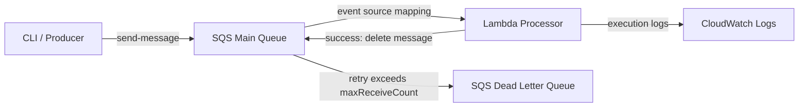

# cdk-beginner-handson

AWS CDK の初学者向けハンズオン用リポジトリ

## Goal

- 第1回: CDK の基本理解と S3 デプロイ
- 第2回: `cdk diff` の理解と SQS で学ぶ L1 / L2 / L3

## Structure

```text
cdk-beginner-handson/
├── bin/
│   └── workshop.ts
├── lambda/
│   └── index.js
├── lib/
│   └── stacks/
│       ├── first-session-stack.ts
│       └── second-session-stack.ts
├── docs/
│   ├── README.md
│   └── requirements.md
├── package.json
├── tsconfig.json
├── biome.json
└── cdk.json
```

## Sessions

### Session 1

- `lib/stacks/first-session-stack.ts`
- S3 Bucket を明示的に定義
- `synth`, `diff`, `deploy` の基本フローを確認

### Session 2

- `lib/stacks/second-session-stack.ts`
- L1: `CfnQueue`
- L2: `Queue`
- L3: `SqsToLambda` （AWS Solutions Constructs の公式パターン）
- SQS + Lambda のデプロイ差分と CLI 確認を実施

## Setup

### Node

Node.js 22 系が使える状態にしてからハンズオンを始めてください。
導入方法は各自の使い慣れたものを使って構いません。
たとえば `mise` を使う場合は、次のように Node をセットアップできます。(`nvm` や `volta` でも問題ありません。)

```bash
mise use -g node@22
node --version
```

### Authentication

- AWS 認証情報を設定したうえで実行してください。
  - 方法①：`aws configure` コマンドで設定
  - 方法②：（認証情報を払い出せない場合）CloudShellでの実行

- 参加者ごとに AWS アカウントを分離する前提です。このため SQS や Lambda の固定名は問題になりにくいですが、S3 のようなグローバル一意名が必要なリソースは別途注意が必要です。

## CDK phase

### init

#### リポジトリを利用する場合

⚠️⚠️⚠️ ここはワークショップで自前で用意するため、スキップしてください ⚠️⚠️⚠️

```bash
# ripository clone 
git clone https://github.com/fujioka-a/cdk-beginner-handson.git

# パッケージインストール
npm ci

```

#### 自前でCDKプロジェクトを作成する場合

```bash
# CDK(コマンド)のインストール
npm install -g aws-cdk

cdk --version

mkdir cdk-beginner-handson
cd cdk-beginner-handson

cdk init sample-app --language=typescript

# アプリ用のパッケージインストール(第2回で使用)
npm install @aws-solutions-constructs/aws-sqs-lambda
```

### implement

第1回と第2回それぞれで、以下ドキュメントを参照してCDK実装しましょう。

- Session 1: [README.session1.md](./docs/README.session1.md)
- Session 2: [README.session2.md](./docs/README.session2.md)

### deploy

```bash 
# ブートストラップ（事前に1回だけ実行すればOK）
npx cdk bootstrap

# CloudFormation テンプレートの生成
npx cdk synth

# デプロイによる差分の事前チェック
npx cdk diff

# デプロイ（スタックを指定）
npx cdk deploy FirstSessionStack

# デプロイ（全スタックを指定）
npx cdk deploy --all --require-approval never --outputs-file cdk-outputs.json
```

### destroy

```bash
# クリーンアップ
npx cdk destroy --all --force
```

## Notes

- 第1回と第2回のリソースは別スタックに分離しています。
- 参加者が読みやすいように、複雑な抽象化は避けてコメントを多めに入れています。
- 第2回では CloudFormation Outputs からキュー URL と Lambda 関数名を確認できます。
- `cdk.json` には推奨 feature flags を固定し、CDK バージョン更新時の挙動差分を減らしています。

## L3 Resource Flow

第2回の L3 では、`SqsToLambda` が以下の関係をまとめて作成します。



## CLI Validation Example

第2回のデプロイ後は、出力された `L2QueueUrl` または `L3QueueUrl` を使って確認できます。

```bash
aws sqs send-message \
  --queue-url <CloudFormation Output の Queue URL> \
  --message-body "hello from workshop"
```
